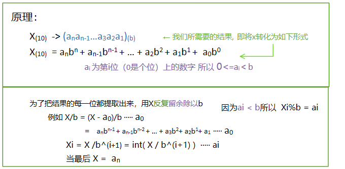
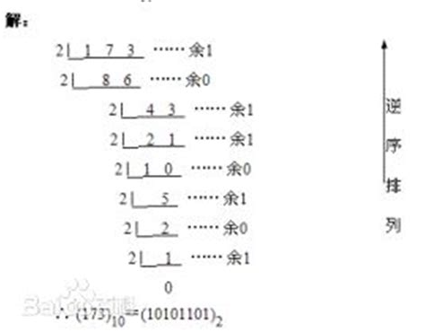
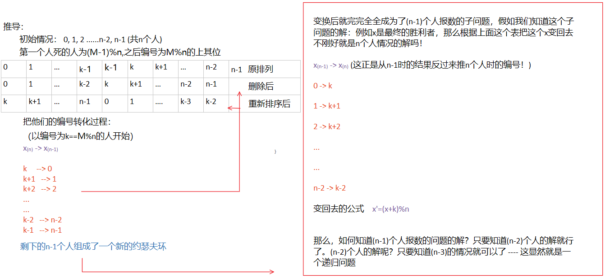
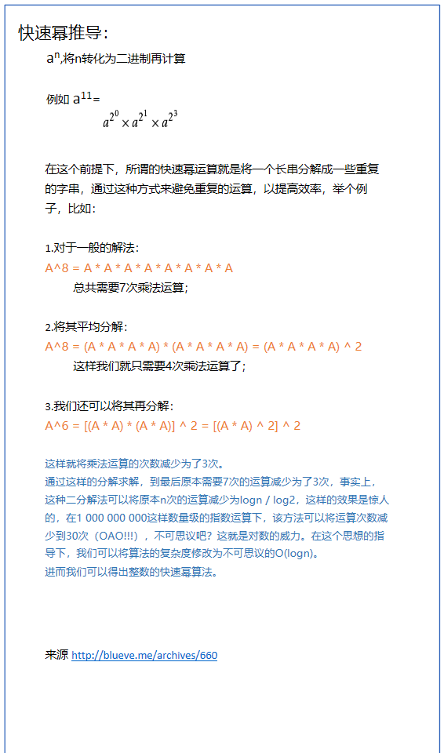
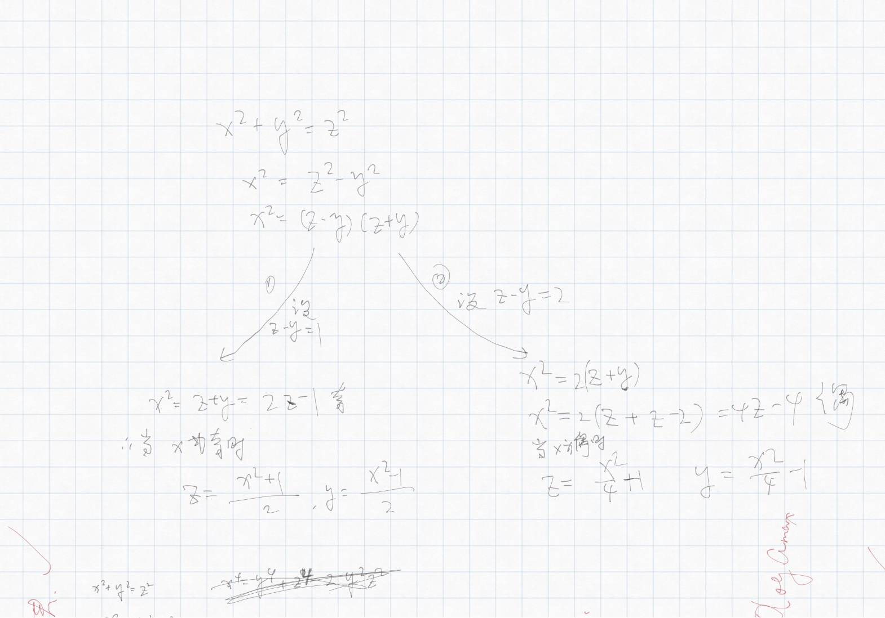

# 欧拉素数筛

如果 $i$ 是素数 那么 $k=i*(i + u)^v$ 不是素数

```C++
bool OLS[100005];//0代表未标记，1代表标记为非素数

OLS[1] = 1;
int end = sqrt(double(N))+1; 
for(int i=2; i<end; i++){
    if(OLS[i]==0)
        for(int j=i; i*j<N; j++)
            for(int k=i*j; k<=N; k*=j)
                OLS[k] = 1;
```


# 进制转换

### 将10进制转换成 8 or 16进制

1. 使用[sprintf和sscanf](onenote:..\STL\方法.one#字符串与数组的互相转换&section-id={3A725A15-FFF5-4C99-8272-DC3A1AE8BDC2}&page-id={830E9630-63CE-402B-BA96-0FECB5DB6E05}&end&base-path=https://d.docs.live.net/3002c12a52278202/文档/ACM！)转换

   像对屏幕输出一样使用格式字符

   %o,%O ->8

   %x,%X ->16

2. 使用[stringstream](onenote:..\STL\容器.one#Stringstream&section-id={5246F245-26B9-44FF-A4F5-11C9DE31C136}&page-id={138DDC20-A2EA-4CA8-99AF-A717517F9D2A}&end&base-path=https://d.docs.live.net/3002c12a52278202/文档/ACM！)进行转换

   在对目标流输入的时使用格式控制符

   oct（） ->8

   hex（） ->16

### 将x从 10进制转换成 b进制 





```C++
int i=0;
while(true)
{
	a[i++] = X%b;
	X/=b;
	if(X==0) break;
}	
```


# 欧几里得

$gcd(a,b) = gcd (b,a\bmod b)$

```C++
int gcd(int a, int b)
{
	if (b == 0) return a;
	return gcd(b, a%b);
}
```

```C++
int qGCD(int a, int b)
{
	if(a == 0) return b;
	if(b == 0) return a;
	if(!(a & 1) && !(b & 1)) // a % 2 == 0 && b % 2 == 0;
		return qGCD(a >> 1, b >> 1) << 1;
	else if(!(b & 1))
		return qGCD(a, b >> 1);
	else if(!(a & 1))
		return qGCD(a >> 1, b);
	else
		return qGCD(abs(a - b), min(a, b));
}
```


# 扩展欧几里得

裴蜀定理：对于不完全为 0 的非负整数 $ a，b$，必然存在整数对  $x，y $，满足他们的贝祖（裴蜀）等式使得 $gcd（a，b）=ax+by$（或$m*gcd（a，b）=ax+by,m=1,2,3,..$)


# 乘法逆元（倒数）

如果 $ab≡1\pmod p$ 且 $gcd(a,p)=1$ 则 $b$ 为 $a$ 关于模 $p$ 的乘法逆元（已知 $a,p$ 求 $b$ )

### 费马小定理求逆元

若 $gcd(a,p)=1$ , 则  $a^{(p-1)} ≡ 1 \pmod p$ 既 $a*a^{p-2}≡1\pmod p$

$a^{p-2}$即为所求

### 扩展欧几里得求逆元

> 因 $ab≡1\pmod p$ 
>
> $ab\bmod p≡1$
>
> $ab+kp≡1,k=-ab\bmod p$
>
> 写成裴蜀方程 $ba+kp=1,gcd(a,p)=1$
>
> 再利用扩展欧几里得算法求解 $b,k$

### 乘法逆元应用

* 做题时如果结果过大一般都会让你模一个数，确保结果不是很大，而这个数一般是1e9+7，而且这个数又是个素数，加减乘与模运算的顺序交换不会影响结果，**但是除法不行**。
* 有的题目要求结果mod一个大质数，如果原本的结果中有除法，**比如除以a,那就可以乘以a的逆元替代。**（除一个数等于乘它的倒数，虽然这里的逆元不完全是倒数，但可以这么理解，毕竟乘法逆元就是倒数的扩展）。


# 裴蜀定理

* 对于不完全为 0 的非负整数 $ a，b$，必然存在整数对  $x，y $，使得 $gcd（a，b）=ax+by$（或$m*gcd（a，b）=ax+by,m=1,2,3,..$)
* 裴蜀有解时必然有无穷多个整数解，求解 $x,y$ 使用**扩展欧几里得定理**
* 特别的 $ax+by=1$有整数解 $x,y$ 当且仅当 $gcd(a,b)=1$


# 约瑟夫环



公式：

$F(1) = 0$

$F(N) = ( F(N-1) + M ) \bmod N$

```C++
int N;//人的总个数
int M;//间隔多少个人

cin>>N;
cin>>M;
int result=0;//N=1情况
for (int i=2; i<=N; i++)
{
    result=(result+M)%i;
}
cout<<"最后自杀的人是："<<result<<endl;

```


# 快速幂（求余）

### 快速幂



```C++
int qPow(int A, int n)
{
	if(n == 0) return 1;
	int ans=1;
 
	while(n)
	{
		if(n & 1) // 若幂为奇数则多乘一次A
		{
			ans *= A;
		}
		A *= A;  // 让A^2 扩张
		n >>= 1; // 右位移等价于除以2
	}
	return ans;
}
```

- - 

### 快速幂求余

题意：求 $a^n \pmod m$

- 定理：[同余定理](onenote:#同余定理 &section-id={4E93A320-3725-45BE-84EB-A7E3694739F4}&page-id={083B15DD-D802-415F-9274-B96C342921FA}&end&base-path=https://d.docs.live.net/3002c12a52278202/文档/ACM！/算法/数论.one)：$ a^p\pmod m ≡ (a \bmod m)^p $
- 所以将每次的ans%=m即可（初始化也可以加a%=m）

```C++
int qPow(int A, int n,int m)
{
	if(n == 0) return 1;
	int ans=1;
 	int A%=m;
	while(n)
	{
		if(n & 1) // 若幂为奇数
		{
			ans *= A;
			ans%=m;
		}
		A = (A*A)%m;
	
		n >>= 1; // 右位移等价于除以2
	}
	return ans;
}
```


# 同余定理

- 同余的概念：

- - 若整数a,b,m,且m>0
  - $(a-b)\bmod m=0$ 既 $ a\bmod m = b\bmod m = 0$
  - 则称a与b对模m同余 记做 $a≡b\pmod m$

 

- 当a与b同余时候则满足以下：

- - 传递性：$a≡b\pmod      m，b≡c\pmod m \dashrightarrow a≡c(\pmod m)$
  - 同余式相乘：$若a≡b\pmod m，c≡d\pmod m，则ac≡bd\pmod m$
  - 同余式相加：$若a≡b\pmod m，c≡d\pmod m，则a±c≡b±d\pmod m$


- 同余推论：

- - $a^p\pmod m ≡ (a\bmod m)^p $


# 费马小定理

若 $gcd(a,p)=1$ ，则  $a^{(p-1)} ≡ 1 \pmod p$

例：求 $2^{100}\bmod 13$

> 由费马小定理可得：$2^{12} = 1\pmod {13}$
>
> 所以原式 = $2^{12*8+4} \pmod {13}$
>
> ​				= $2^{12*8}*16 \pmod {13}$
>
> ​				= $1*16 \pmod {13}$
>
> ​				= $3$


# 费马大定理

$x^n+y^n=z^n$ 在 $n>2$ 时没有正整数解

$n=2$	勾股定理

$n=1$	$x+y=z$


# 构造勾股数



已知$x$ , 求$ x^2+y^2=z^2$中的$y$与$z$，均为正整数

结果	$x=2n-1\dashrightarrow y=\frac{x^2-1}{2}\qquad z=\frac{x^2+1}{2}$  由题意可得 $x>1$

​			$x=2n \dashrightarrow y=\frac{x^2}{4}-1\qquad z=\frac{x^2}{4}+1$  由题意可得 $x>2$

​			所以综上当 $x<3$ 的时候无解


# 康拓展开


# 逆方


# 高斯消元