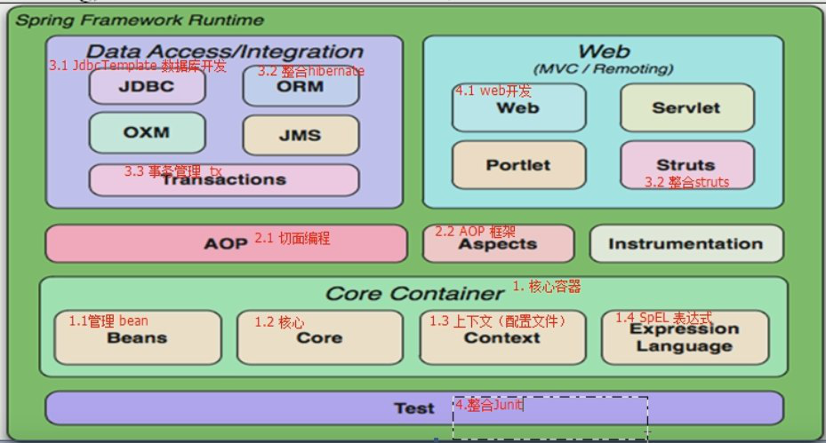
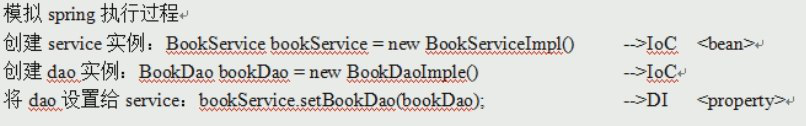
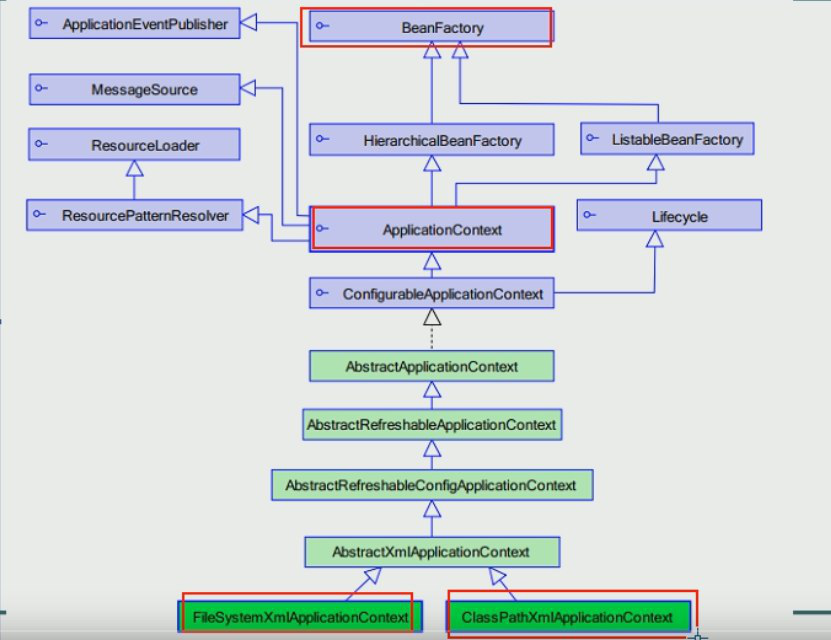

# Spring 框架

# Spring 概述

* Spring核心：**控制反转(IoC)**和**面向切面(AOP)**

### 优点

* 方便对象之间的耦合，简化开发
  * 自动创建和维护所有对象（Bean）

# Spring 体系结构



### **核心容器**：

* Beans 对象
* core 核心
* centext 配置文件
* expression SpEl表达式


# IoC(控制反转)

将类扔到Spring容器里面，创建新对象再拿出来

- Spring容器 ： `application`Context 配置文件

  - 配置 <bean>
    - id ： 引用的时候用的名称
    - class : 装载的类名称

- 从容器取出类：

  - 首先得到目标容器

    ```java
    ApplicationContext testContext = new ClassPathXmlApplicationContext(beansxmlPath);
    ```

  - 再从容器中取出类赋予对象（需要强转）

    ```java
    UserService test2 = (UserService) testContext.getBean("UserServiceID"); 
    ```

和将类扔到字典(dict)里差不多


### 1.导入4+1 jar包

* 4个**核心容器** +1个依赖（commons-logging…jar)

  spring-**beans**-`vision`.RELEASE.jar

  spring-**context**-`vision`.RELEASE.jar

  spring-**core**-`vision`.RELEASE.jar

  spring-**expression**-`vision`.RELEASE.jar

  commons-logging-`vision`.jar

  *在IDEA中创建Spring项目后自动导入*

### 2.目标类

* 提供UserService接口和实现类

* 获得UserService实例

  > 之前直接new一个对象
  >
  > Spring中将由Spring创建对象实例 即**IOC控制反转**
  >
  > 创建对象实例的工作交给Spring
  >
  > 需要实例对象时直接从Spring拿

  ```java
  public interface UserService {//虚类
      public void addUser();
  }
  ```

  ```java
  public class UserServiceImpl implements UserService {//写出实现类
      @Override
      public void addUser(){
          System.out.println("a_ioc add user");
      }
  }
  ```

  

### 3.配置文件

* 位置：*任意*，一般于src下

* 名称：*任意*，常用`application`Context.xml

* 内容：schema 约束

  ```xml
  <?xml version="1.0" encoding="UTF-8"?>
  <beans xmlns="http://www.springframework.org/schema/beans"
         xmlns:xsi="http://www.w3.org/2001/XMLSchema-instance"
         xsi:schemaLocation="http://www.springframework.org/schema/beans
                             http://www.springframework.org/schema/beans/spring-beans.xsd">
          <!--这个就是传说中的schema约束-->
          <!--配置service
              <bean> 配置需要创建的对象
                  id: 用于从Spring容器获得实例用的
                  class: 需要创建实例的全限定类名 ？？？？
          -->
          <!--将实现类放到容器中,一般起名为UserServiceID-->
          <bean id="UserServiceID" class="com.itheima.a_ioc.UserServiceImpl"></bean>
  
  </beans>
  ```

  

### 4.测试

```java
public class TestIOC {
    @Test       //声明测试，则不需要写main
    public void demo01(){
        //之前获取实例
        UserService test1 = new UserServiceImpl();
        test1.addUser();

        //Spring方法
            //1获得容器
        String beansxmlPath = "com/itheima/a_ioc/beans.xml";
        ApplicationContext testContext = new ClassPathXmlApplicationContext(beansxmlPath);
            //2创建实例
        UserService test2 = (UserService) testContext.getBean("UserServiceID"); //从容器中获取实例，需要强转
        test2.addUser();

    }
}

```


# DI(依赖注入)

* 依赖

  * is a: **继承  **子类继承父类，子类就是父类

  * has a:  **依赖**  B的成员变量中有A  ->  B依赖A 

    * 既一个对象需要使用另一个对象

    ```java
    class B_class{
        private A_class a;//B依赖A
    }
    ```

* 注入：通过 setter 方法进行依赖对象实例的设置

  ```java
  class BookServiceImpl{
      //之前开发 接口 = 实现类
      private BookDao bookDao = new BookDaoImpl();
      //Spring开发
      private BookDao;
      setter方法注入BookDao
  }
  ```

  

  <property>设置为<bean>的子标签

### 1.目标类

* Dao

  ```java
  public class BookDaoImpl implements BookDao {
      @Override
      public void addBook() {
          System.out.println("di  add book");
      }
  }
  ```

  

* Service

  ```java
  public class BookServiceImpl implements BookService {
      //1 原方法 接口 = 实现类
      private BookDao bookDao1 = new BookDaoImpl();
  
      //2 Spring方法  接口+setter方法
      private BookDao bookDao2;
      public void setBookDao2(BookDao bookDao2) {//setter方法
          this.bookDao2 = bookDao2;
      }
  
      @Override
      public void addBook() {
          this.bookDao1.addBook();
          this.bookDao2.addBook();
      }
  }
  ```

  * 原方法中  bookDao1与类是绑定的关系
  * Spring方法中  通过Setter() 可以改变绑定的bookDao2

### 2.配置文件

```xml
<?xml version="1.0" encoding="UTF-8"?>
<beans xmlns="http://www.springframework.org/schema/beans"
       xmlns:xsi="http://www.w3.org/2001/XMLSchema-instance"
       xsi:schemaLocation="http://www.springframework.org/schema/beans http://www.springframework.org/schema/beans/spring-beans.xsd">
        <!--
        模拟Spring执行过程
            创建service实例                 ->Ioc <bean>
            创建dao实例                     ->Ioc
            将dao注入service （setter()）   ->DI  <property>

            <property> 用于属性注入
            name:bean的属性名， 通过setter获得
            ref: 依赖的id值
        -->
        <bean id="BookServiceID" class="com.itheima.b_di.BookServiceImpl">
            <property name="bookDao2" ref="BookDaoID"></property>
        </bean>
        <bean id="BookDaoID" class="com.itheima.b_di.BookDaoImpl"></bean>

</beans>
```

### 3.测试

```java
public class TestDI {
    @Test       //声明测试，则不需要写main？？？
    public void demo00(){
        ApplicationContext testContext = new ClassPathXmlApplicationContext("com/itheima/b_di/beans.xml");
        BookService test1 = (BookService) testContext.getBean("BookServiceID");
        test1.addBook();
    }
}
```


# 核心API



* ##### BeanFactory ：生成任意的bean ，*采用延迟加载，只有在第一次getBean的时候才会实例化Bean*

* ##### **ApplicationContext** ：BeanFactory的子接口，功能更强（强大就完事了），当配置文件被加载就对象实例化

  * **ClassPathXmlApplicationContext** 用于加载classpath(src)下的指定的xml

    * xml运行时位置 –> /WEB-INF/classes/…xml

  * FileSystemXmlApplicationContext 用于加载指定盘符路径下的xml

    * xml运行时位置 –> /WEB-INF/…xml
    * 通过java web -> ServletContext.getRealPath() 获得盘符路径

  * **getBean **:获取实例

    ```java
    //获取后强制转换
    UserService test2 = (UserService) testContext.getBean("UserServiceID");
    //提前告知类型
    UserService test2 = testContext.getBean("UserServiceID",UserService.class);
    ```

    

# 装配Bean基于XML

### 1.实例化方式

* 默认构造

  ```xml
  <bean id="" class=""></bean>
  ```

* 静态工厂

  * 常用于Spring整合其他框架

    * 用于生产实例对象，所有方法必须是static
    * 将其他框架的东西交给Spring，将会具有Bean的所有特性

  * 搭建静态工厂：

    ```java
    public class TestBeanFactory {
        public static UserService createService(){	//创建实例的静态方法
            return new UserServiceImpl();
        }
    }
    ```

  ```xml
  <bean id="" class=工厂的全限定类名（包名+类名） factry-method=静态方法></bean>
  ```

* 实例工厂

  * 必须先有工厂的实例对象，然后通过实例对象去创建对象

    * 所有的方法都是非静态的

  * 工厂交给Spring

  * 然后创建工厂实例并调用创建方法

    ```java
    <!--创建实例工厂-->
    <bean id="TestFactoryID" class="com.itheima.c_inject.c_factory.TestFactory"></bean>
    <!--获得UserService
        创建实例工厂并调用创建对象方法
    -->
    <bean id="UserServiceID" factory-bean="TestFactoryID" factory-method="createService"></bean>
    ```

    