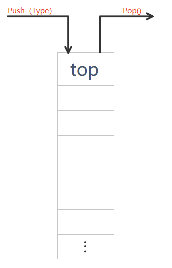

# stack

### 构造对象：

- stack      < T > s; 创建一个空的栈
- stack      < T > s (s1); 复制构造函数 构造一个与s1一样的栈

### 入与出：

- pop() 顶部元素出栈
- push(const      T &a) 尾部推入元素a

### 引用元素

- top()      返回值为顶部元素的值
- 内部是隐藏的 不可以使用下标引用元素

### 容器状态

- empty()      返回值为bool 如果是空为1 否者为0
- size()      返回值为元素个数

$\\$

