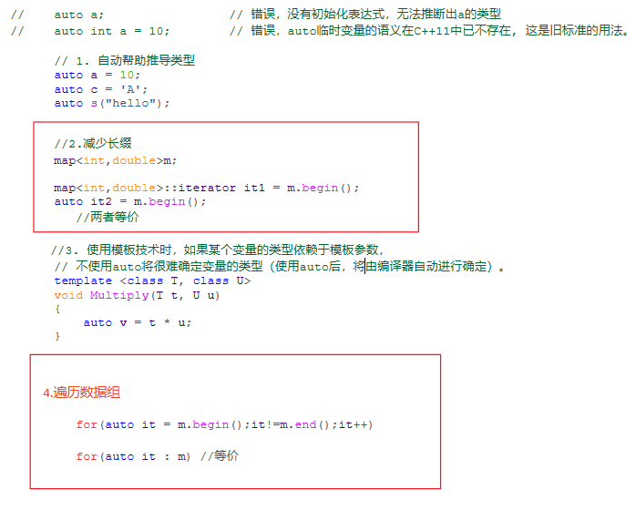
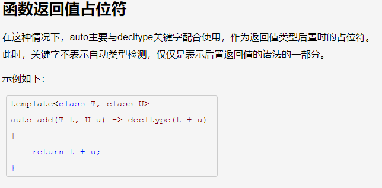

# auto

##  自动类型推断

  auto自动类型推断，用于从初始化表达式中推断出变量的数据类型。通过auto的自动类型推断，可以大大简化编程工作。

---

## 返回值占位符

---

## 注意事项

![1  2  3  4  5  6  7  int* p  int* pp  auto x  auto* Y  = new auto(auto.assets/clip_image001-1579084746036.png); //fine  = new auto(); // should be initialized  = new auto(); // Hnvmn .  no intiatizer  = new auto(S); // Fine. Here y is a int*  auto z = new auto(9); //Fine. Here z is a int* (It is not just an int)  fisizeoßntypeid  1 int value = 123;  2 auto x2  3  4 auto x3  = (auto) value;  // no casting using auto  = // same as above  // This is too much..  auto Xl = 5, X2 = 5.0,  cannot combine Like thi: ](file:///C:/Users/15363/AppData/Local/Temp/msohtmlclip1/01/clip_image001.png)

![1  2  3  4  5  6  7  int* p  int* pp  auto x  auto* Y  = new auto(auto.assets/clip_image001-1579084749483.png); //fine  = new auto(); // should be initialized  = new auto(); // Hnvmn .  no intiatizer  = new auto(S); // Fine. Here y is a int*  auto z = new auto(9); //Fine. Here z is a int* (It is not just an int)  fisizeoßntypeid  1 int value = 123;  2 auto x2  3  4 auto x3  = (auto) value;  // no casting using auto  = // same as above  // This is too much..  auto Xl = 5, X2 = 5.0,  cannot combine Like thi: ](file:///C:/Users/15363/AppData/Local/Temp/msohtmlclip1/01/clip_image001.png)

![1  2  3  4  5  6  7  8  9  1  2  3  4  5  6  const int i = 99  auto j i;  j = 100  // Now let us  auto& k i;  k = 100;  // Similarly with  to  (auto.assets/clip_image001-1579084756060.png) ,  j is int, rather than const int  Fine. As j is not constant  have reference  Now k is const int'  Error. k is constant  volatile qualifer  int a[9];  auto j = a  ) . name( ;  auto& k = a;  (k) . name ( ) ;  // This will print int*  // This print int [9] ](file:///C:/Users/15363/AppData/Local/Temp/msohtmlclip1/01/clip_image001.png)