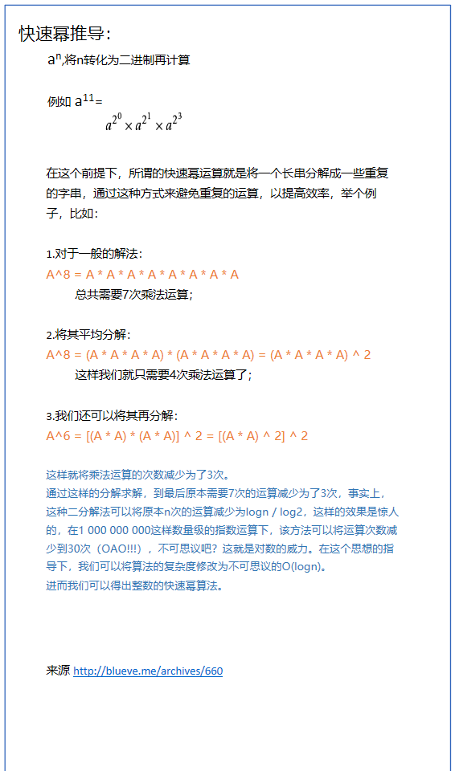

# 快速幂（求余）

### 快速幂



```C++
ll qPow(ll A, ll n)
{
	if(n == 0) return 1;
	ll ans=1;
 
	while(n)
	{
		if(n & 1) // 若幂为奇数则多乘一次A
		{
			ans *= A;
		}
		A *= A;  // 让A^2 扩张
		n >>= 1; // 右位移等价于除以2
	}
	return ans;
}
```


### 快速幂求余

题意：求 $a^n \pmod m$

- 定理：[同余定理](onenote:#同余定理 &section-id={4E93A320-3725-45BE-84EB-A7E3694739F4}&page-id={083B15DD-D802-415F-9274-B96C342921FA}&end&base-path=https://d.docs.live.net/3002c12a52278202/文档/ACM！/算法/数论.one)：$ a^p\pmod m ≡ (a \bmod m)^p $
- 所以将每次的ans%=m即可（初始化也可以加a%=m）

```C++
ll qPow(ll a, ll n,ll p)
{
	if(n == 0) return 1;
	ll ans=1;
 	ll a%=m;
	while(n)
	{
		if(n & 1) 	// 若幂为奇数
		{
			ans *= a;
			ans%=p;
		}
		a = (a*a)%p;
	
		n >>= 1; // 右位移等价于除以2
	}
	return ans;
}
```

---

