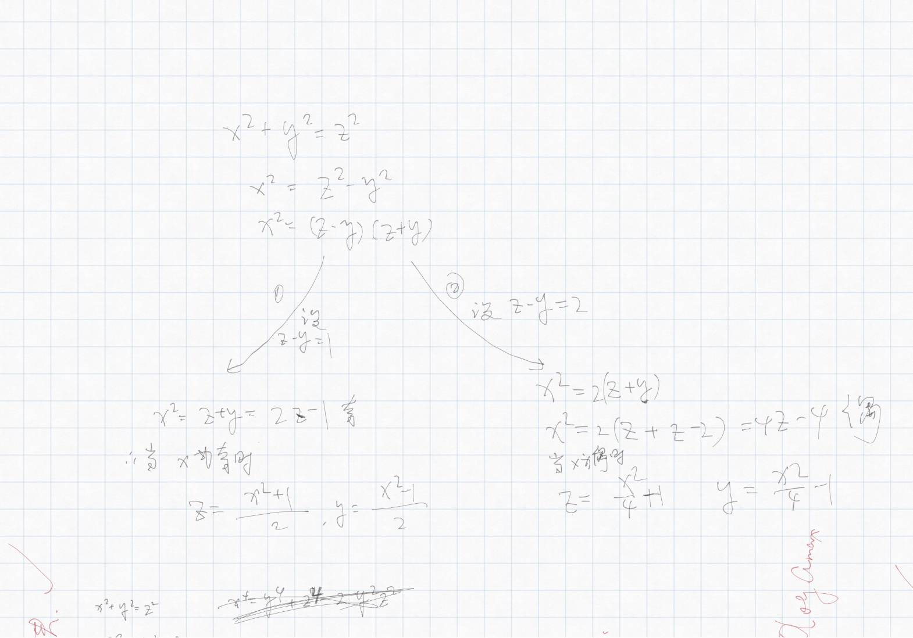

# 构造勾股数

已知$x$ , 求$ x^2+y^2=z^2$中的$y$与$z$，均为正整数

结果	$x=2n-1\dashrightarrow y=\frac{x^2-1}{2}\qquad z=\frac{x^2+1}{2}$  由题意可得 $x>1$

​			$x=2n \dashrightarrow y=\frac{x^2}{4}-1\qquad z=\frac{x^2}{4}+1$  由题意可得 $x>2$

​			所以综上当 $x<3$ 的时候无解

