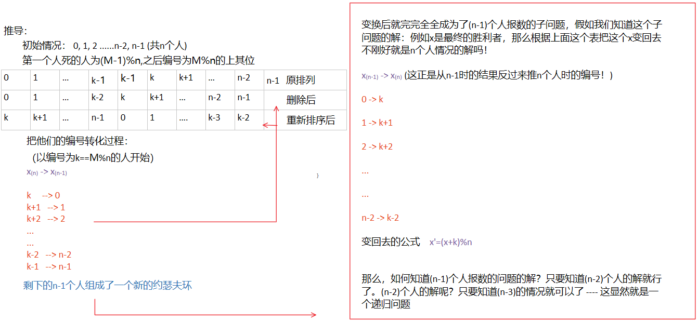

# 约瑟夫环



公式：

$F(1) = 0$

$F(N) = ( F(N-1) + M ) \bmod N$

```C++
int N;//人的总个数
int M;//间隔多少个人

cin>>N;
cin>>M;
int result=0;//N=1情况
for (int i=2; i<=N; i++)
{
    result=(result+M)%i;
}
cout<<"最后自杀的人是："<<result<<endl;

```

---

