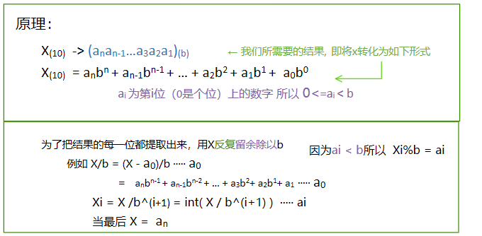
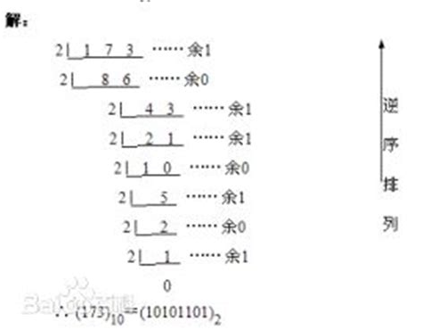

# 进制转换

### 将10进制转换成 8 or 16进制

1. 使用[sprintf和sscanf](onenote:..\STL\方法.one#字符串与数组的互相转换&section-id={3A725A15-FFF5-4C99-8272-DC3A1AE8BDC2}&page-id={830E9630-63CE-402B-BA96-0FECB5DB6E05}&end&base-path=https://d.docs.live.net/3002c12a52278202/文档/ACM！)转换

   像对屏幕输出一样使用格式字符

   %o,%O ->8

   %x,%X ->16

2. 使用[stringstream](onenote:..\STL\容器.one#Stringstream&section-id={5246F245-26B9-44FF-A4F5-11C9DE31C136}&page-id={138DDC20-A2EA-4CA8-99AF-A717517F9D2A}&end&base-path=https://d.docs.live.net/3002c12a52278202/文档/ACM！)进行转换

   在对目标流输入的时使用格式控制符

   oct（） ->8

   hex（） ->16

### 将x从 10进制转换成 b进制 





```C++
int i=0;
while(true)
{
	a[i++] = X%b;
	X/=b;
	if(X==0) break;
}	
```

---

