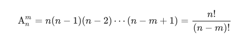
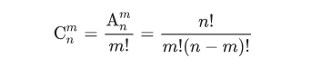
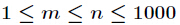
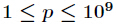
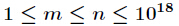
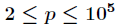

# 组合数


## 组合数取模

排列计算

组合计算	

特别的 $m>n$时， $A_n^m=C_n^m=0$

---


### 方案1 杨辉三角 二重循环

,


1

1	1

1	2	1

1	3	3	1

$C_n^m =\left\{
\begin{aligned}
1&	&m=0\\
C_{n-1}^{m-1}+C_{n-1}^{m}&	&0<m<n\\
1&	&m=n\\
\end{aligned}
\right.$

---


### 方案2 阶乘预处理

$1<=m,n<=1e5，1<=p<=1e9$

打出$n!\bmod p,m!\bmod p$的表，然后直接拿来计算

##### 不取模的运算

```C++
ll C(ll n, ll m){
    if(m>n)	return 0;
    return fac[n]/(fac[n-m]*fac[m]);
}
```

##### 取模的运算

我们知道除法并不满足同余定理，所以用乘法逆元做处理

$C_n^m\bmod p=\frac{n!}{m!(n-m)!} \bmod p= n!*(m!)'*((n-m)!)' \pmod p$

```C++
ll C(ll n, ll m, ll p){
    if(m==0)	return 1;
    return fac[n] * inv(fac[n-m],p)%p * inv(fac[m],p)%p;
}
```

---


### 方案3 Lucas定理

，，**其中 $p$ 必须为素数**

```C++
long long Lucas(long long n, long long m, long long p) {
    if (m == 0) return 1;
    return (C(n % p, m % p, p) * Lucas(n / p, m / p, p)) % p;
}
```


## Lucas定理

Lucas 定理用于求解大组合数取模的问题，**其中 $p$ 必须为素数**

$C_n^m \bmod p = C_{\lfloor n/p \rfloor}^{\lfloor m/p \rfloor}*C_{n \bmod p}^{m \bmod p} \bmod p$，$\lfloor x \rfloor代表向下取整$

观察上述表达式，可知 $n\bmod p$ 和 $m \bmod p$ 一定小于 $p$ ，可以直接求解，$ C_{\lfloor n/p \rfloor}^{\lfloor m/p \rfloor}$ 可以继续用Lucas定理求解。边界条件：当 $m=0$ 时，返回 $1$。

时间复杂度为$O(f(p)+g(n)log n)$ ，其中$f(n)$为预处理组合数的复杂度， $g(n)$为单次求组合数的复杂度。