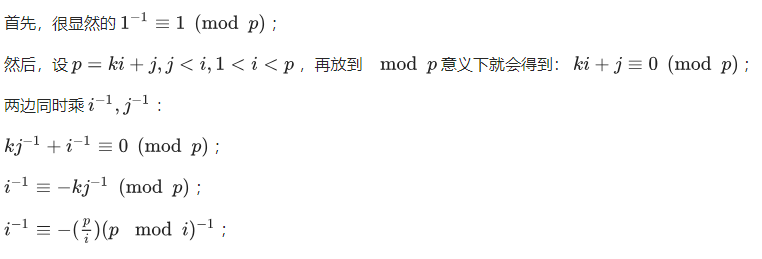

# 逆元 & exgcd & 费马


## 乘法逆元（倒数）

如果 $ab≡1\pmod p$ 且 **$gcd(a,p)=1$** 则 $b$ 为 $a$ 关于模 $p$ 的乘法逆元（已知 $a,p$ 求 $b$ )


### 费马小定理求逆元

若 $gcd(a,p)=1$ , 则  $a^{(p-1)} ≡ 1 \pmod p$ 既 $a*a^{p-2}≡1\pmod p$

$a^{p-2}$即为所求，此时应用快速幂即可

```C++
ll inv(ll a,ll p)
{
	return qpow(a,p-2,p); //a^(p-2) mod p
}
```


### 扩展欧几里得求逆元

> 因 $ab≡1\pmod p$ 
>
> $ab\bmod p≡1$
>
> $ab+kp≡1,k=-ab\bmod p$
>
> 写成裴蜀方程 $ba+kp=1,gcd(a,p)=1$
>
> 再利用扩展欧几里得算法求解 $b,k$

```C++
int inv(int n, int p) {
    int x, y;
    if(exgcd(n, p, x, y) == 1) {
        x = x % p;
        return x >= 0 ? x : p + x;
    } else {
        return -1;
    }
}
```

### 线性求逆元

##### 1.一次性求出$1,2,3,...,n$中每个数关于 $p$ 的逆元

如果对于每个数进行单次求解，以上两种方法就显得慢了，很有可能超时。



```C++
inv[1] = 1;
for (int i = 2; i <= n; ++i) 
    inv[i] = (long long)(p - p / i) * inv[p % i] % p;
```

##### 2.求任意n个数的逆元


```C++
s[0] = 1;
for (int i = 1; i <= n; ++i) s[i] = s[i - 1] * a[i] % p;
sv[n] = qpow(s[n], p - 2);
// 当然这里也可以用 exgcd 来求逆元,视个人喜好而定.
for (int i = n; i >= 1; --i) sv[i - 1] = sv[i] * a[i] % p;
for (int i = 1; i <= n; ++i) inv[i] = sv[i] * s[i - 1] % p;
```


### 乘法逆元应用

* 做题时如果结果过大一般都会让你模一个数，确保结果不是很大，而这个数一般是1e9+7，而且这个数又是个素数，加减乘与模运算的顺序交换不会影响结果，**但是除法不行**。
* 有的题目要求结果mod一个大质数，如果原本的结果中有除法，**比如除以a,那就可以乘以a的逆元替代。**（除一个数等于乘它的倒数，虽然这里的逆元不完全是倒数，但可以这么理解，毕竟乘法逆元就是倒数的扩展）。

---


## 裴蜀定理

* 对于不完全为 0 的非负整数 $a,b$，必然存在整数对 $x,y$ 使得$gcd（a，b）=ax+by（或m*gcd（a，b）=ax+by,m=1,2,3,..)$

* 裴蜀有解时必然有无穷多个整数解，求解 $x,y$ 使用**扩展欧几里得定理**
* 特别的 $ax+by=1$有整数解 $x,y$ 当且仅当 $gcd(a,b)=1$

---


## 扩展欧几里得

* 裴蜀定理：对于不完全为 0 的非负整数 $a，b$，必然存在整数对  $x，y$，满足他们的贝祖（裴蜀）等式使得$gcd（a，b）=ax+by（或m*gcd（a，b）=ax+by,m=1,2,3,..)$

### 扩展欧几里得求解 $x,y$

* 在欧几里得算法里，递归部分的核心是这样的$gcd(a,b) = gcd(b,\bmod b)=gcd(b,a-b\frac{a}{b})$，我们将由此得出与 x，y 相关的递归关系。
* 根据裴蜀定理，我们可以找到四个整数$x,y,x',y'$，使得  $ax+by=gcd(a,b)$ 且  $bx'+(a-\frac{a}{b})y'=gcd(b,a-b\frac{a}{b})$
* 这两个等式的右侧是相等的，于是我们得到：$ax+by = bx'+(a-b\frac{a}{b})y'$，整理一下就是$a(x-y')+b(y-(x'-\frac{a}{b}y'))=0$
* 我们希望这个等式对一切 a，b 都成立，于是$x=y', y=x'-\frac{a}{b}y'$
* 这样，要求解 x 和 y，只需要求解 x'，y'，由于 x'，y' 对应的问题规模更小，所以可以进行递归的运算。最后找一下边界条件：当 $b=0$ 时， $gcd(a,0)$ 对应 $x=1,y=0$
* 这种算法的思想和欧几里得算法是一致的，而且它在求出最大公约数的同时，求解了一组适于裴蜀定理的系数，所以叫做扩展欧几里得算法。

```C++
int exgcd(int a, int b, int& x, int& y) {
    if(a < b) return exgcd(b, a, y, x);
    if(b == 0) {
        x = 1; y = 0;
        return a;
    } else {
        int x1;
        int d = exgcd(b, a % b, x1, x);
        y = x1 - a / b * x;
        return d;
    }
}
```

​		x 和 y 用引用的形式传入，返回值是最大公约数。

### 扩展欧几里得算法的迭代形式

```C++
int exgcd(int a, int b, int& x, int& y) {
    if(a < b) return exgcd(b, a, y, x);
    int m = 0, n = 1;
    x = 1; y = 0;
    while(b != 0) {
        int d = a / b, t;
        t = m; m = x - d * t; x = t;
        t = n; n = y - d * t; y = t;
        t = a % b; a = b; b = t;
    }
    return a;
}
```

[知乎扩展欧几里得](https://zhuanlan.zhihu.com/p/58241990)

### 扩展欧几里得计算乘法逆元

* 当我们用扩展欧几里得算法找到一组 x 和 y 满足 $ax+by=1$，就可以得出 $ax≡1\pmod b$，也就是说 x 是 a 的乘法逆元，且 $gcd(a,x)=1$。
* 显然，如果 x 是 a 的乘法逆元，那么所有的 ![[公式]](逆元&exgcd&费马大小定理.assets/equation-1578715809548.svg) 也是 a 的乘法逆元。这表明，一定有 a 的一个乘法逆元在区间 ![[公式]](逆元&exgcd&费马大小定理.assets/equation-1578715809561.svg) 内。

```C++
int inv(int n, int p) {
    int x, y;
    if(exgcd(n, p, x, y) == 1) {
        x = x % p;
        return x >= 0 ? x : p + x;
    } else {
        return -1;
    }
}
```

---


## 费马小定理

若 $gcd(a,p)=1$ ，则  $a^{(p-1)} ≡ 1 \pmod p$

例：求 $2^{100}\bmod 13$

> 由费马小定理可得：$2^{12} = 1\pmod {13}$
>
> 所以原式 = $2^{12*8+4} \pmod {13}$
>
> ​				= $2^{12*8}*16 \pmod {13}$
>
> ​				= $1*16 \pmod {13}$
>
> ​				= $3$

---


## 费马大定理

$x^n+y^n=z^n$ 在 $n>2$ 时没有正整数解

$n=2$	勾股定理

$n=1$	$x+y=z$

