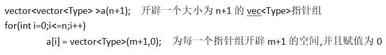

# 板子扩充

## STL

### stack

- 构造对象：

- - stack      < T > s; 创建一个空的栈
  - stack      < T > s (s1); 复制构造函数 构造一个与s1一样的栈

- 入与出：

- - pop() 顶部元素出栈
  - push(const      T &a) 尾部推入元素a

- 引用元素

- - top()      返回值为顶部元素的值

- - 内部是隐藏的 不可以使用下标引用元素

- 容器状态

- - empty()      返回值为bool 如果是空为1 否者为0
  - size()      返回值为元素个数

### queue

标准队列

- 构造对象：

- - queue      < T > q; 创建一个空的队列
  - queue      < T > q (q1); 复制构造函数 构造一个与q1一样的队列

- 入与出：

- - pop() 推出首部元素
  - push(const      T &a) 尾部推入元素a

- 引用元素

- - front()      返回首部元素的值
  - back()      返回尾部元素的值

- - 内部是隐藏的 不可以使用下标引用元素

- 容器状态

- - empty()      返回值为bool 如果是空为1 否者为0
  - size()      返回值为元素个数

### priority_queue

- 构造对象

- - priority_queue<类型>q;      默认构造最大堆

  - - 可以使用'<' 与       '>'重载定义排序规则

    - - 例：


- priority_queue<类型,vector<类型>,排序规则 >q;

- - less<T> 规则      越来越小--最大堆，顶部最大，相当于默认
  - greater<T>规则      越来越大---最小堆，顶部最小

- - cmp函数 自定义规则

  - - priority_queue<T,vector<T>,cmp>q;
    - 

- 入与出

- - pop() 推出顶部元素
  - push(constT      &a) 插入a并保证有序

- 引用元素

- - top()      返回顶部元素的值

- - 无法使用下标引用

- 容器状态

- - empty()      返回值为bool 如果是空为1 否者为0
  - size()      返回值为元素个数

- 说明

- - 优先队列的实现方式为堆，只能引用顶部元素，并且在每一次插入或者推出都遵循堆的方式，以保证时刻有序。

### vector

- 构造对象

- - vector <T> v; 默认构造一个空的动态数组

  - - 开辟初始空间

    - - vector <T> v(int n);        构造一个已经开辟了n大小的动态数组

    - 开辟空间并赋值

    - - vector <T> v(int n,const T &t) ;        开辟n大小并全部赋值为t

    - 复制构造函数

    - - vector <T> v(v1);        复制v1
      - vector <T> v(地址1，地址2);复制        [地址1,地址2) 区间内另一个数组的元素

- 插入

- - push_back(T &a) 在尾部插入a
  - insert( v.begin()+i , a ) 在v[i]      前面插入a

- 删除

- - erase( v.begin()+i ) 删除 v[i]
  - erase( v.begin()+i , v.begin()+j ) 删除[ i      , j ) 之间的元素
  - clear() 清除全部数据

- 容器状态

- - empty() 判断是否为空
  - size() 返回元素个数
  - max_size() 返回最大可允许的元素数量

- 引用与访问

- - v[i] 可以通过下标访问

- - at(int pos) 相当于v[pos] 返回值为pos位置的元素

- - front() 返回首元素的值
  - back() 返回尾元素的值
  - begin() 返回头指针,指向第一个元素
  - end() 返回尾指针,指向最后元素的下一个位置

- 高级用法

- - 二维动态数组

  - - 实现原理

    - - 容器的内的元素类型可以是任何类型,甚至是他自己的类型

  - - 构造方式

    - -   

- 引用

- - 可以通过 a[ i ] [ j ] 来访问，并且横纵都是动态的

- 二维内动态数组

- - vector<T>a[n]； 开辟a[0->n-1]的固定数组，每一个元素都是动态的一位数组

- - 可以通过a[i]. 引用函数 ， a[ i ] [ j ] 访问元素
  - 只有二维是动态的，一维依旧静态

### list

- 构造对象

- - list<T>c 创建空链表

  - - 开辟空间

    - - list<T>c ( n );        开辟n个元素

    - 赋值构造

list<T>c ( n , const &a ); 开辟n个元素 并赋值为a

- 复制构造

- - list<T>c (c1); 复制c1
  - list<T>c (地址1,地址2);      复制区域内元素构造

- 添加元素

- - push_back(T &a) 尾部添加一个元素
  - push_front(T &a) 首部添加一个元素
  - insert(地址，T &a) 在位置前插入元素
  - insert(地址,n,T &a）在位置前插入n个元素
  - insert(地址，地址1，地址2）在地址位置插入[地址1，地址2）的元素

- 移除元素

- - pop_back() 推出尾部元素
  - pop_front() 推出首部元素
  - erase( 地址 i ) 删除目标地址元素
  - erase( 地址i , 地址 j ) 删除[ 地址 i ,地址 j ) 之间的元素
  - remove(T &a) 删除与a匹配的元素
  - clear() 清除全部数据

- 引用元素

- - front() 返回首元素值
  - back() 返回尾元素值
  - begin() 返回首地址
  - end() 返回尾元素地址的下一位

- - 无法使用下标引用

- 容器状态

- - empty() 返回值为bool 如果是空为1 否者为0
  - size() 返回值为元素个数

- 链表操作

- - 重新定义长度

  - - resize(n) 重新定义长度n，超出原始长度的部分用0代替
    - resize(n,T &a) 重新定义长度n，超出部分用a代替

  - - 如果重新定义长度小于原长度则删除多余的

- - reverse() 反转链表
  - sort() 将链表排序，默认升序
  - sort(cmp) 自定义排序规则

- 双链表合成

- - c1.merge(c2)   合并2个有序的链表并使之有序,从新放到c1里,释放c2。
  - c1.merge(c2,comp)         合并2个有序的链表并使之按照自定义规则排序之后从新放到c1中,释放c2。
  - c1.splice(c1.beg,c2,c2.beg)         将c2的beg位置的元素连接到c1的beg位置，并且在c2中施放掉beg位置的元素
  - c1.splice(c1.beg,c2,c2.beg,c2.end)         将c2的[beg,end)位置的元素连接到c1的beg位置并且释放c2的[beg,end)位置的元素

### set&map

- 构造函数 

- - set<T> s      

  - - set<T>s(s1)       复制构造

  - map<T>m

  - - map< T1,  T2 >m(m1)

  - - 相当于 set< pair<T1,T2> >
    - 用起来和python的集合一样
    - 一切排序与查找以T1为主

- - multiset <T> ms

  - - 用法和set一样，但是允许存入多个同样元素
    - 就是map<T,int>，但是操作方式更为简单
    - 使用 count(键值）查询

 

- 引用

- - begin()      返回容器第一个元素的位置
  - end() 返回容器最后一个元素的下一个位置

- - 无法使用下标引用
  - map可以通过m[键值]来引用或修改T2

- - 遍历：可以使用      set<>::iterator it = s.begin()

  - - for(;it!=s.end();it++)       进行遍历
    - map 同理

  - 对没有插入过的键值元素进行运算，初始元素值为0；

  - - 如 m[str]++; 后 m[str]值为1

- 搜索

- - find (key-value) 返回值为指定键值的元素地址

  - - 没有该元素则返回       end()

- - lower_bound      (键值）返回第一个（最小）大于等于目标键值的元素地址

  - upper_bound      (键值）返回最后一个（最大）大于目标键值的元素地址

  - count (键值) 返回某一个值在集合中出现的次数

  - - 因为集合元素不能重复，所以相当于判断元素是否存在于集合中

- 容器状态

- - empty()      判断是否为空
  - size()      返回容器大小
  - max_size()      返回容器最大可以允许的大小

- 插入

- - insert      (key-value) 将键值插入集合中，如果值已经存在则直接返回

  - - 返回值是 pair<set<int>::iterator,bool>类型的 (插入地址或原元素地址，是否成功）  

- - insert      (地址1，地址2）将 [地址1,地址2) 的元素全部插入集合
  - map插入键值的方式必须是insert      (pair<T1,T2>)
  - map可以使用 m[键值] = 值 直接插入（如python一般）

- 删除

- - erase (iterator)      删除目标地址的元素
  - erase (地址1，地址2）删除 [地址1,地址2) 的元素
  - erase      (key-value) 删除指定键值的元素
  - clear()      清空容器

- 说明

- - 容器实现方法是二叉平衡搜索树，即红黑树(RB),所以容器有序，搜索速度快到Olgn

### iterator

(快乐)

### string

- *内置函数*

- - substr(下标 i,长度  j）返回截取[ i , i+j ) 的子string

- - find(string  str, pos = 0) 
    - 从字符串的pos位置开始，查找子字符串str。如果找到，则返回该子字符串首次出现时其首字符的索引；否则，返回string::npos

### reverse

头文件 <algorithm>

reverse (地址1,地址2）

反转 [地址1，地址2）内所有数据的排列顺序

### element

- \#inlude <algorithm>

- max_element(地址1，地址2）

- - 重载 max_element(地址1，地址2，cmp)

- - 返回值为相当于按照规则排序后最后位置的值（最大值）

- min_element(地址1，地址2）

- - 重载 min_element(地址1，地址2，cmp）

- - 返回值为最小值

### sort

- \#inlude <algorithm>

- sort (地址1，地址2） 万能排序函数

- - sort（地址1，地址2，cmp） 可以重载排序规则
  - 时间复杂度与快排相近

利用sort快速判断一组数是否完全相等。

>  sort(a,a+n)排序之后，如果a[0] == a[n-1] （第一个等于最后一个）
>
> 则整个队列相等。
>
> 但是这样会改变原队列顺序，所以要备份，但是备份用时等于普通的线性判断。
>
> 所以如果仍然需要原数组的话，就不要用这个方法。数组可以随便嚯嚯的时候推荐使用。

### QueryPerformance

```C++
double time=0;
double counts=0;
LARGE_INTEGER nFreq;
LARGE_INTEGER nBeginTime;
LARGE_INTEGER nEndTime;
QueryPerformanceFrequency(&nFreq);
QueryPerformanceCounter(&nBeginTime);//开始计时

	执行代码

QueryPerformanceCounter(&nEndTime);//停止计时
time=(double)(nEndTime.QuadPart-nBeginTime.QuadPart)/(double)nFreq.QuadPart;//计算程序执行时间单位为s

cout<<"操作 ";
cout<<"次数"<<"c ";
cout<<"cost"<<time*1000<<"ms"<<e0ndl;

```

### lower/upper_bound 

- lower_bound     (begin，end，值） 

- - 返回 第一个（最小）大于等于目标键值的元素地址

- upper_bound     (begin，end，值）

- - 返回 最后一个（最大）大于目标键值的元素地址

- 查到到的地址 p - begin = p位置元素的下标 = begin->p的元素个数-1 

### sprinf,sscanf

sprintf(char*,输出), sscanf(char*,输入) 函数,用法和printf，scanf一样。区别在于对应输入输出端口是字符串。

 

例：sprintf(char_a , "%d" , int_x) 将x输出到a中 （int -> char)

​		sscanf(char_a,"%d",&int_x) 从a中输入x (int <- int )

## 死亡位运算

| 按位与   | a&b  |
| -------- | ---- |
| 按位或   | a\|b |
| 按位异或 | a^b  |
| 按位取反 | ~a   |
| 左移     | a<<b |
| 右移     | a>>b |

位运算优先级十分低，比如n&1== 0中，后面优先级大于前面。所以要加括号，(n&1)==1 才能达到目的。

 技巧: 运用位运算快速判断奇偶

​	 n&1   奇数末尾为1，所以n&00000001结果为1。否者偶数为0。

a>>1 为算式，并不会改变a的值！ 需要额外使用赋值语句（如a >>=1)

### cin cout

-------------Std::cout控制符：

- Setbase(int)    设置输出数字的进制，不支持2进制；

- - 进制输出控制符：hex 16 ,oct 8 ；

 

- << Setiosflags(ios::fixed)     << Setprecision(int) 设置小数点后长度；
- Setw(int)设置最低域宽，setfill(char)设置填充字符

- ios::sync_with_stdio(false);以及cin.tie(NULL) ///与c输入输出函数兼容关闭

- - 可以加速cin cout的速度 直接写就行 开启之后无法使用getline(cin,str)，这种c输入输出与流输入输出结合的函数 

 

---------------Cin

char c[20];

Char a；

- cin.get(a) 或者 a=cin.get()     类似于getchar 接收一个字符,可以接收空格

- - Cin.get(char)

- - Cin.get(char* ,      接受字符数目) 接收字符串
  - 不能对string进行操作

 

- Cin.getline(char*,字符个数,结束字符)

- - 字符个数中’\0’占一位 可以接收空格

- - 不支持string

 

- getline(cin,str) 函数用来处理string读入一整行数据，

- - 其应用方式与cin>>str;类似，可以返回EOF
  - 可以通过函数重载 getline(cin,str,’’)      让函数输入到指定字符后停止输入。其默认为‘\n’。

### next_permutation

- \#inlude <algorithm>

- bool     next_permutation(地址1，地址2）

- - 将[地址1，地址2）内的数组排列成按字典序排列的下一种全排列方式

- - 并返回重排列后是否还有下一种

- - bool      pre_permutation(地址1，地址2）

  - - 功能同上，不过是上一种

```C++
string str = "abc";
do
{
	cout<<str<<endl;	
}while( next_permutation(str.begin(),str.end()) )

输出结果为:
abc
acb
bac
bca
cab
cba

```

## 数学

### 欧拉筛

如果i是素数 那么 i*(i+u)^v 不是素数 (u>=0,v>=1)

```C++
//0为素数 1为标记非素数
const int max_n = 10005;
bool a[max_n];
int i,j,k,end = sqrt(double(max_n))+1;
a[1] = 1;
for(i=2;i<=end;i++)
    if(a[i]!=1)
        for(j=i;i*j<=max_n;j++)
            for(k=i*j;k<=max_n;k*=j)
                a[k] = 1;
```

### 进制转换

10->b进制

```C++
int i=0;
while(true)
{
	a[i++] = X%b;
	X/=b;
	if(X==0) break;
}	
```

最终数组倒序输出即为结果

### gcd

```C++
int gcd(int a, int b)
{
	if (b == 0) return a;
	return gcd(b, a%b);
}
```

### 约瑟夫环

```C++
#include<iostream>
using namespace std;
int main()
{
	int N;//人的总个数
	int M;//间隔多少个人
 
	cin>>N;
	cin>>M;
	int result=0;//N=1情况
	for (int i=2; i<=N; i++)
	{
		result=(result+M)%i;
	}
	cout<<"最后自杀的人是："<<result+1<<endl;//result要加1
	return 0;
}
```

### 快速幂

```C++
int qPow(int A, int n)
{
	if(n == 0) return 1;
	int ans=1;
 
	while(n)
	{
		if(n & 1) // 若幂为奇数则多乘一次A
		{
			ans *= A;
		}
		A *= A;  // 让A^2 扩张
		n >>= 1; // 右位移等价于除以2
	}
	return ans;
}

```

```C++
int qPow(int A, int n,int m)
{
	if(n == 0) return 1;
	int ans=1;
 	int A%=m;
	while(n)
	{
		if(n & 1) // 若幂为奇数
		{
			ans *= A;
			ans%=m;
		}
		A = (A*A)%m;
	
		n >>= 1; // 右位移等价于除以2
	}
	return ans;
}
```

### 费马小定理


## 树

### 线段树

#### 基本线段树

```C++
#include<bits/stdc++.h>
#define fr(i,n)	for(int i=0;i<n;i++)
using namespace std;
#define Tree_Max_Size 10005


struct segment_tree_node{
    int l,r;
    int w;
    int lazy;
};


class segment_tree{
private:
    segment_tree_node tree[Tree_Max_Size];
public:
    segment_tree(int l,int r,int v=0,int k = 1){Build(l,r,v,k);}

    void Build(int l,int r,int v=0,int k = 1){
        tree[k].l=l;
        tree[k].r=r;
        tree[k].lazy=0;
        if(l==r){
            tree[k].w=v;
        }else{
            Build(l,(l+r)>>1,k<<1);
            Build((l+r)/>>1|1,r,k<<1|1);
            tree[k].w = PushUp(tree[k<<1].w,tree[k<<1|1].w);
        }
    }

    void Update(int l,int r,int w,int k = 1){
        /*lazy*/
        if(tree[k].l==l&&tree[k].r==r){
            //只更新大段
            tree[k].w += w;
            //子段的更新存入缓存等需要的时候再进行
            tree[k].lazy += w;
        }else if(tree[k].l==tree[k].l){
            //到达叶子
            tree[k].w += w;
        }else{
            PushDown(k);
            int mid = (tree[k].l+tree[k].r)>>1;
            if(l<=mid)
                Update(l,mid,w,k<<1);
            if(mid+1<=r)
                Update(mid+1,r,w,k<<1|1);
            tree[k].w = PushUp(tree[k<<1].w,tree[k<<1|1].w);
        }
    }

    int Inquire(int l,int r,int k = 1){
        if(tree[k].l==l&&tree[k].r==r){
            return tree[k].w;
        }else if(tree[k].l==tree[k].r){
            return tree[k].w;
        }else{
            PushDown(k);
            int mid = (tree[k].l+tree[k].r)>>1;
            int lw = 0,rw = 0;
            if(l<=mid)
                lw = Inquire(l,mid,k<<1);
            if(mid+1<=r)
                rw = Inquire(mid+1,r,k<<1|1);
            return PushUp(lw,rw);
        }
    }

    /*PushDown 更新子段的值和lazy*/
    void PushDown(int k){
        //将lazy向下传递
        tree[k<<1].lazy += tree[k].lazy;
        tree[k<<1].w += tree[k].lazy;
        tree[k<<1|1].lazy += tree[k].lazy;
        tree[k<<1|1].w += tree[k].lazy;
        //清空传递完的lazy
        tree[k].lazy = 0;
    }

    /*PushUp*/
    int PushUp(int w1,int w2){
        //return w1+w2;
        //return w1*w2;
        return max(w1,w2);
    }
};

```

#### ZKW线段树

```C++
const int M=1e5+111;
int n,m,q;
int sum[M<<2],mn[M<<2],mx[M<<2],add[M<<2];
inline void build(){
    for(m=1;m<=n;m<<=1);
    for(int i=m+1;i<=m+n;++i)
        sum[i]=mn[i]=mx[i]=read();
    for(int i=m-1;i;--i){
        sum[i]=sum[i<<1]+sum[i<<1|1];
        mn[i]=min(mn[i<<1],mn[i<<1|1]),
        mn[i<<1]-=mn[i],mn[i<<1|1]-=mn[i];
        mx[i]=max(mx[i<<1],mx[i<<1|1]),
        mx[i<<1]-=mx[i],mx[i<<1|1]-=mx[i];
    }
}
inline void update_node(int x,int v,int A=0){
    x+=m,mx[x]+=v,mn[x]+=v,sum[x]+=v;
    for(;x>1;x>>=1){
        sum[x]+=v;
        A=min(mn[x],mn[x^1]);
        mn[x]-=A,mn[x^1]-=A,mn[x>>1]+=A;
        A=max(mx[x],mx[x^1]),
        mx[x]-=A,mx[x^1]-=A,mx[x>>1]+=A;
    }
}
inline void update_part(int s,int t,int v){
    int A=0,lc=0,rc=0,len=1;
    for(s+=m-1,t+=m+1;s^t^1;s>>=1,t>>=1,len<<=1){
        if(s&1^1) add[s^1]+=v,lc+=len, mn[s^1]+=v,mx[s^1]+=v;
        if(t&1)    add[t^1]+=v,rc+=len, mn[t^1]+=v,mx[t^1]+=v;
        sum[s>>1]+=v*lc, sum[t>>1]+=v*rc;
        A=min(mn[s],mn[s^1]),mn[s]-=A,mn[s^1]-=A,mn[s>>1]+=A,
        A=min(mn[t],mn[t^1]),mn[t]-=A,mn[t^1]-=A,mn[t>>1]+=A;
        A=max(mx[s],mx[s^1]),mx[s]-=A,mx[s^1]-=A,mx[s>>1]+=A,
        A=max(mx[t],mx[t^1]),mx[t]-=A,mx[t^1]-=A,mx[t>>1]+=A;
    }
    for(lc+=rc;s;s>>=1){
        sum[s>>1]+=v*lc;
        A=min(mn[s],mn[s^1]),mn[s]-=A,mn[s^1]-=A,mn[s>>1]+=A,
        A=max(mx[s],mx[s^1]),mx[s]-=A,mx[s^1]-=A,mx[s>>1]+=A;
    }
}
inline int query_node(int x,int ans=0){
    for(x+=m;x;x>>=1) ans+=mn[x]; return ans;
}
inline int query_sum(int s,int t){
    int lc=0,rc=0,len=1,ans=0;
    for(s+=m-1,t+=m+1;s^t^1;s>>=1,t>>=1,len<<=1){
        if(s&1^1) ans+=sum[s^1]+len*add[s^1],lc+=len;
        if(t&1) ans+=sum[t^1]+len*add[t^1],rc+=len;
        if(add[s>>1]) ans+=add[s>>1]*lc;
        if(add[t>>1]) ans+=add[t>>1]*rc; 
    }
    for(lc+=rc,s>>=1;s;s>>=1) if(add[s]) ans+=add[s]*lc;
    return ans;
}
inline int query_min(int s,int t,int L=0,int R=0,int ans=0){
    if(s==t) return query_node(s);
    for(s+=m,t+=m;s^t^1;s>>=1,t>>=1){
        L+=mn[s],R+=mn[t];
        if(s&1^1) L=min(L,mn[s^1]);
        if(t&1) R=min(R,mn[t^1]);
    }
    for(ans=min(L,R),s>>=1;s;s>>=1) ans+=mn[s];
    return ans;
}
inline int query_max(int s,int t,int L=0,int R=0,int ans=0){
    if(s==t) return query_node(s);
    for(s+=m,t+=m;s^t^1;s>>=1,t>>=1){
        L+=mx[s],R+=mx[t];
        if(s&1^1) L=max(L,mx[s^1]);
        if(t&1) R=max(R,mx[t^1]);
    }
    for(ans=max(L,R),s>>=1;s;s>>=1) ans+=mx[s];
    return ans;
}

```

## 博弈论

### 巴什博奕

​     ![巴 什 博 弈  一 堆 石 子 共 n 个 ， 两 个 人 轮 流 皇  简 介  无 论 先 手 者 怎 么 皇  每 次 至 少 皇 1 个 至 多 皇 m 个 ， 先 皇 完 的 人 获 胜  最 后 皇 的 一 定 是 后 手 ， 所 以 为 先 手 者 的 " 必 败  态 ' ' ， n = t * 〔 m + 月 同 理 也 为 必 败 态  n = m + 1 + k  k<=m 一 > 必 胜 态 先 手 者 可 先 皇 走 k 个 ， 将 n = m + 1 的 必 败 态 给  对 方  000000000000000000000  k>m. 可 以 将 k 看 做 k = 〔 t 一 1 广 〔 m + 月 + r, 同 理 n = t * 〔 m + 月 + r ， 回 到 了 讨  论 n = m + 1 的 问 题  结 论  r!=O 为 必 胜 态  r=O 为 必 败 态  ． 00 0 -  可 以 先 皇 走 r 个 ， 将 n ： t * 〔 m + 月 必 败 态 给 对 方  陷 入 n = t * 〔 m + 月 必 败 态  By Msy  -0 0 耘 “ 一 ](板子扩充.assets/clip_image001-1573821365636.png)  

### nim

每个单独的博弈局合并用 ^ 算

## 例题

### 1166 E. The LCMs Must be Large

题意：

> 有一个长度为n（n<=10^4) **内容未知**的序列，再给m(m<=50）个限制，每个限制会给一个位置集合S，对应n中的位置，需要让S中所有位置上的数的lcm严格大于序列里剩下的数的lcm，求是否存在一个这样的序列满足所有限制。（lcm最小公倍数）


推导:

- 有定理     lcm(a,b,c)>=lcm(a,b)

* 若存在一对集合没有交集则有：

- - lcm(S1)      > lcm(others) >=lcm(S2)
  - lcm(S2)      > lcm(others) >=lcm(S1)
  - 形成悖论

- 所以只要有一对集合没有交集则为不可能。

- 否者为可能

 

代码：

复杂度On2m 暴力查找是否存在无交集的集合

```C++
#include <bits/stdc++.h>
#define fr(i,k) for(int i=0;i<k;i++)
#define frr(i,j,k) for(int i=j;i<k;i++)

using namespace std;
typedef long long ll;

int main()
{
    set<int>S[55];
    int n,m,l,inp;
    while(cin>>m>>n){
        fr(i,m){
            cin>>l;
            fr(j,l){
                cin>>inp;
                S[i].insert(inp);
            }
        }
        bool posibool = true;

        fr(i,m){
            frr(j,i+1,m){
                bool hasb = false;
                for(auto s1:S[i]){
                    if(S[j].find(s1)!=S[j].end()){
                        hasb = true;
                        break;
                    }
                }
                if(hasb==false){
                    posibool = false;
                    goto loop;
                }
            }
        }

        loop:
        if(posibool)
            cout<<"possible"<<endl;
        else
            cout<<"impossible"<<endl;

    }
    return 0;
}

```

## Python

### [::-1]


##### 

- [x] 脑子x3
- [x] 板子（一平方米）
- [x] ~~死亡黑书~~ 数学手册
- [x] 翻译手和他的牛津黑暗真典
- [x] flag
- [x] 信心
- [ ] 献祭一名队友
- [ ] 快乐水x3
- [ ] 捧一张牌
- [ ] 再献祭一名队友