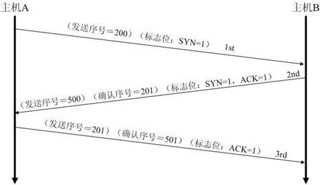

# 网络与系统

### 1.死锁

* 死锁
  * 是指两个或两个以上的进程在执行过程中，由于竞争资源或者由于彼此通信而造成的一种阻塞的现象，若无外力作用，它们都将无法推进下去。此时称系统处于死锁状态或系统产生了死锁，这些永远在互相等待的进程称为死锁进程。
* 死锁预防
  * 这是一种较简单和直观的事先预防的方法。方法是通过设置某些限制条件，去破坏产生死锁的四个[必要条件](https://baike.baidu.com/item/必要条件)中的一个或者几个，来预防发生死锁。预防死锁是一种较易实现的方法，已被广泛使用。但是由于所施加的限制条件往往太严格，可能会导致系统资源利用率和系统吞吐量降低。
* 死锁避免
  * 系统对进程发出的每一个系统能够满足的资源申请进行动态检查，并根据检查结果决定是否分配资源；如果分配后系统可能发生死锁，则不予分配，否则予以分配。这是一种保证系统不进入死锁状态的动态策略。

### 2.TCP/IP

* TCP/IP四层模型

  * 

* 三次握手

  * 1.客户端 A 发送 SYN 包（SYN=j）到服务器 B，并进入SYN_SEND 状态，等待服务器 B 确认。
  * 2.服务器 B 收到 SYN 包，必须确认客户 A 的 SYN（ACK=j+1），同时自己也发送一个 SYN 包（SYN=k），即 ACK+SYN 包，此时服务器 B 进入SYN_RECV 状态。
  * 3.客户端 A 收到服务器 B 的 SYN＋ACK 包，向服务器 B 发送确认包 ACK（ACK=k+1）。此包发送完毕，客户端 A 和服务器 B 进入 ESTABLISHED 状态，完成三次握手。
  * 

* 四次挥手

  * 1.客户端 A 发送一个 FIN，用来关闭客户 A 到服务器 B 的数据传送。

  * 2.服务器 B 收到这个 FIN，它发回一个 ACK，确认序号为收到的序号加1。和 SYN 一样，一个 FIN 将占用一个序号。
  * 3.服务器 B 关闭与客户端 A 的连接，发送一个 FIN 给客户端 A。
  * 4.客户端 A 发回 ACK 报文确认，并将确认序号设置为收到序号加1。
  * 

### 3.路由器和交换机区别

* 物理区别
  * 交换机通常端口比较多，路由器端口少体积小。
* 工作层次不同
  * 交换机在**数据链路层**（实现数据帧的转发），而路由器**在网络层**（肩负着网络互连的作用）
* 数据的转发对象不同
  * 交换机是根据MAC地址转发数据帧，而路由器是根据IP地址来转发数据报。IP地址决定最终数据要到达某一台主机，而MAC地址是决定下一跳将要交给哪一台设备（一般是交换机或者路由器），IP地址是软件实现的，可以描述主机所在的网络，MAC地址是硬件实现的，每一个网卡在出厂时都会将全世界唯一的MAC地址固化在ROM中，因此MAC不可改，IP可改
* 分工不同
  * 交换机主要是用于组建局域网，而路由器则负责让主机连接外网，多台主机可以通过网线连接到交换机，这时候就组建好了局域网，就可以通过网线连接到交换机，这时就组建好了局域网，就可以将数据发给局域网中的其他主机，然而通过交换机组建的局域网是不能访问外网的，这时就需要路由器为我们来打开外网大门，局域网的所有主机使用的都是私网的IP,所以必须通过，路由器转换为公网IP之后才能访问外网
* 冲突域和广播域
  * 交换机分割冲突域，但不分割广播域，而路由器分割广播域。由交换机连接的网段，仍属于同一个广播域，广播数据包会在交换机连接的所有网段上传播，这时会导致广播风暴和安全漏洞。而连接在路由器上的网段会被分配到不同的广播域。路由器不会转发广播数据。交换机会转发广播数据给局域网中的所有主机，值得说明的是单播的数据包在局域网中会被交换机唯一的送到目标主机，其他主机不会接受到数据，这是区别于原始的集线器的。

### 4.虚拟机

* 虚拟机（Virtual Machine）指通过[软件](https://baike.baidu.com/item/软件/12053)模拟的具有完整[硬件](https://baike.baidu.com/item/硬件)系统功能的、运行在一个完全[隔离](https://baike.baidu.com/item/隔离/33079)环境中的完整[计算机系统](https://baike.baidu.com/item/计算机系统/7210959)。

### 5.进程、线程、管程

* 进程：进程是一个具有一定独立功能的程序关于某个数据集合的一次运行活动。它是操作系统动态执行的[基本单元](http://baike.baidu.com/view/693012.htm)，在传统的操作系统中，进程既是基本的[分配单元](http://baike.baidu.com/view/954991.htm)，也是基本的执行单元。
* 线程：线程是进程中的实体，一个进程可以拥有多个线程，一个线程必须有一个父进程。线程不拥有系统资源，只有运行必须的一些数据结构；它与父进程的其它线程共享该进程所拥有的全部资源。线程可以创建和撤消线程，从而实现程序的并发执行。一般，线程具有就绪、阻塞和运行三种基本状态。
* 管程：管程定义了一个数据结构和能为并发进程所执行的一组操作，这组操作能同步进程和改变管程中的数据。

### 6.操作系统和网络原理

* 操作系统：方便的人机交互接口
* 网络：将计算机连接在一起
* 互联网：将网络连接在一起


# 开发

### 1.语言

* python 
* JavaScript
* C/C++
* C#
* Java
* Go
* PHP
* …..

### 2.面向过程编程和面向对象编程

* PO：过程为中心的编程思想,分析出解决问题的步骤，然后用函数把这些步骤一步一步实现。面向过程编程，数据和对数据的操作是分离的
* OO：面向对象编程是将事物对象化，通过对象通信来解决问题。面向对象编程，数据和对数据的操作是绑定在一起的

### 3.python优势

* 比其他语言学习更简单
* 有很强的计算库和图像库
* 从设计到编程的过程简单快速
* 可移植、可扩展性好

### 4.移动端开发

* 编译器 Android：javac ,  iOS：clang
* API：应用程序编程接口，预先定义的函数，提供应用程序与开发人员基于某软件或硬件得以访问一组例程的能力，而又无需访问源码，或理解内部工作机制的细节。
* 源码：原始程序代码，编译前的程序代码
* 变量命名法：
  * 蛇形命名法[[snake_case](https://en.wikipedia.org/wiki/Snake_case)]
  * 驼峰命名法[[camelCase](https://en.wikipedia.org/wiki/CamelCase)]
  * 帕斯卡命名法[[PascalCase](http://c2.com/cgi/wiki?PascalCase)]
  * 匈牙利命名法[[Hungarian notation](https://en.wikipedia.org/wiki/Hungarian_notation)]
  * ACM命名法[a1a2a3b1b2b3]
* 模板方法[[TemplateMethod](https://www.runoob.com/design-pattern/template-pattern.html)]


# 数据结构与算法

### 1.数据结构

* Stack、Queue、Trees和各种令人脑洞大开的节点连接方式

### 2.二叉搜索树

* 左子树节点值<=右子树节点值
* 搜索：整个查找过程就是从根节点开始一直向下的一条路径，若假设树的高度是h，那么查找过程的时间复杂度就是O(h)
* 
* 插入：插入算法与搜索类似，从根节点开始，迭代或者递归向下移动，直到遇到一个空的指针NIL，需要插入的值即被存储在该结点位置，同样复杂度为O(h)
* 

### 3.摩尔投票法

* 提问： 给定一个i数组，找出该数组中出现次数大于数组长度一半的值。

* 在每一轮投票过程中，从数组中找出一对不同的元素，将其从数组中删除。这样不断的删除直到无法再进行投票，如果数组为空，则没有任何元素出现的次数超过该数组长度的一半。如果只存在一种元素，那么这个元素则可能为目标元素。

  ```C++
  int solve(int a[],int n){
      int temp;
      int temp_size = 0;
      
      for(int i=0;i<n;i++){
          if(temp_size==0||temp==a[i]){
              temp = a[i];
              temp_size++;
          }
          else temp_size--;
      }
      return temp;
  }
  ```

### 4.线段树

* **父亲的区间是[a,b],(c=(a+b)/2)左儿子的区间是[a,c]，右儿子的区间是[c+1,b]，线段树需要的空间为数组大小的四倍**

* 整一个线段树

  * 建树

    ```c++
    struct node{
        int l,r;
        int w;//权值
    }nodes[10005];
    
    void Build(int l,int r,int k = 0){
        nodes[k].l = l;
        nodes[k].r = r;
     	
        if(l==r){
            nodes[k].w = 0;
            return;
        }
    	Build(l,(l+r)/2,k*2);	//[l,mid]
        Build((l+r)/2+1,r,k*2+1);//[mid+1,r]
        nodes[k].w = nodes[k*2].w+nodes[k*2+1].w;
    }
    ```

  * 插入?区间修改

    ```c++
    void update(int l,int r,int w,int k = 0){
        if(nodes[k].l==nodes[k].r)//遍历到叶子
            nodes[k].w = w;
        else{
            int mid = (nodes[k].l+nodes[k].r)/2;
            if(l<=mid)
                insert(l,mid,w,k*2);
            if(mid+1<=r)
                insert(mid+1,r,w,k*2+1);
            nodes[k].w = nodes[k*2].w+nodes[k*2+1].w;
        }
    }
    ```

  * 查询

    ```c++
    int search(int l,int r,int k = 0){
        if(nodes[k].l==l&&nodes[k].r==r)
            return nodes[k].w;
        else{
            int mid = (nodes[k].l+nodes[k].r)/2;
            int lw = 0,rw = 0;
            if(l<=mid)
                lw = search(l,mid,k*2);
            if(mid+1<=r)
                rw = search(mid+1,r,k*2+1);
            return lw+rw;
        }
    }
    ```

### 5.缺失

### 6.KMP&AC自动机

* KMP
  * KMP算法是一种改进的[字符串匹配](https://baike.baidu.com/item/字符串匹配)算法，[时间复杂度](https://baike.baidu.com/item/时间复杂度)O(m+n)。
  * 利用匹配失败后的信息，尽量减少模式串与主串的匹配次数以达到快速匹配的目的
  * https://blog.csdn.net/liu940204/article/details/51318281
  * 略答，太强了，日后慢慢整理
* AC自动机
  * 一个常见的例子就是给出n个单词，再给出一段包含m个字符的文章，让你找出有多少个单词在文章里出
  * KMP进化版？写入任务计划中

### 7.加密

* python MD5加密

  ```python
  import hashlib as hb
  password = hb.md5()
  password.update('123456789asdf**')
  password_s = password.hexdigest()
  print password_s
  ```

### 8.推荐算法

* 抖音的流量分配是去中心化的
* 在微博和公众号上，如果你没有粉丝的话，你发的内容就不会有人看。但是抖音就不一样，你可以完全没有粉丝。所有的抖音的用户，你拍的任何一个视频，无论质量好还是质量坏，发布了之后一定会有播放量，从几十到上千都有可能
* 算法机制：
  * 视频与用户画像的匹配程度
  * 热度（赞、评论、转发等）
  * 发布时间
  * 根据用户数据和内容标签计算两者的匹配程度

### 9.代码查重机制

* [MOSS(Measure Of Software Similarity) ](http://theory.stanford.edu/~aiken/moss/)
* [机制论文](http://theory.stanford.edu/~aiken/publications/papers/sigmod03.pdf)


# Linux

### 1.自爆指令

* 递归删除根目录
* 真正意义上的自爆
* 文件一旦通过rm命令删除，则无法恢复
* 一些linux系统已经无法使用rm -rf /
* 防范：一定要经常备份，一定要经常备份，一定要经常备份
* 不说了，去给我的阿里云备份压压惊

### 2.后缀名的作用

* Filename Extension，或作延伸文件名
* 文件后缀名相当于文件的身份证，知道后缀名就能知道它是哪一类的文件，就知道需要使用什么方式来打开该文件

### 3.系统运行速度影响主要因素

* 软件层面和硬件层面
* 软件层面：常数的大小，算法的复杂度
* 硬件层面：CPU性能，硬件契合度，时钟频率

### 4.Linux优势

* 跨平台硬件支持
* 开源
* 对硬件要求低
* 可定制度高，因为开源，所以衍生比较广泛
* Shell操作比较方便

### 5.系统

* Ubuntu、Centos
  * 在Linux原版上增加一些功能诸如图形界面或者更改一些设定的系统
  * 差异性并不是很大
  * 但是可以适应各种不同的工作，家用主机或者开发环境或者服务器架构
* Unix
  * UNIX 操作系统由肯•汤普森（Ken Thompson）和丹尼斯•里奇（Dennis Ritchie）发明。它的部分技术来源可追溯到从 1965 年开始的 Multics 工程计划，该计划由贝尔实验室、美国麻省理工学院和通用电气公司联合发起，目标是开发一种交互式的、具有多道程序处理能力的分时操作系统，以取代当时广泛使用的批处理操作系统。
  * 说明：分时操作系统使一台计算机可以同时为多个用户服务，连接计算机的终端用户交互式发出命令，操作系统采用时间片轮转的方式处理用户的服务请求并在终端上显示结果（操作系统将CPU的时间划分成若干个片段，称为时间片）。操作系统以时间片为单位，轮流为每个终端用户服务，每次服务一个时间片。


# 安全

### 1.人肉搜索

* QQ号可以得到的信息
  * 常用昵称
  * 常用邮箱
  * QQ号
  * 不知道是不是真实的所在地和手机号，或者可能没有
* 在个大社交平台(人人网，微信，贴吧，微博，推特，FB等等）上用利用所得的信息检索账号，尤其是一些需要绑定手机号或者获取用户所在地的无良社交平台
  * 用匹配度高的账号信息做参考
  * 以猜测信息的真实性
  * 一些学校要求学生使用诸如易班，人人网，学信网这种的信息录入平台，可以作为重点检索对象
* 在得到置信度高的信息后可以进行进一步人肉
  * 查询手机号归属地
  * 分析朋友圈，QQ空间等一些发布的信息
  * 在易班得到对方的学校信息，学校归属地，学校官网
  * 人人网可以得到的住址，姓名，手机号等等
  * 在学校的内网得到的学生信息，点名批评CG和教务系统
* 剩下的就是干坏事时间了
* 总体就是尽可能的运用网络上对方所遗留的信息，去获得更多的信息

### 2.黑客&脚本小子

* 脚本：一般来说的计算机脚本程序是确定的一系列控制计算机进行运算操作动作的组合，在其中可以实现一定的逻辑分支
  * 自动化某一系列操作
  * 做游戏自动脚本
* 黑客可以利用网络知识和计算机漏洞，服务器渗透等对目标进行攻击或者集成一种渗透脚本。
  * 渗透脚本可能可以使不懂原理的人正常使用
  * 诸如Kali集成的软件

### 3.校园网破解设备限制

* 设备限制原理：绑定MAC地址
* 只要使用一样的地址就可以实现多台设备使用了
* 可以通过路由器或者USB网卡进行骚操作
* 然而校园网在寝室连不上（发信器距离我不到5m），在教学楼有屏蔽，图书馆信号不好，唯一能用的就是青阳湖上方和工程训练中心，不说了，停办

### 4.暗网

* 存储在[网络](https://baike.baidu.com/item/网络/1717974)数据库里、但不能通过[超链接](https://baike.baidu.com/item/超链接/97857)访问而需要通过动态网页技术访问的资源集合，不属于那些可以被标准搜索引擎索引的表面网络

* 乎任何有抱负的[通用搜索引擎](https://baike.baidu.com/item/通用搜索引擎)都有一个共同的梦想：整合人类所有信息，并让大家用最便捷的方式各取所需。

  对此，百度说：“让人们最便捷地获取信息，找到所求”；谷歌说：“整合全球信息，使人人皆可访问并从中受益”。这两者表达的实际上是同一个愿景。

  然而，这注定是一项不可能完成的任务。据科学家估测，人类信息大概只有0.2%实现了web化，并且这个比例很可能在持续降低。更甚的是，即便在已经Web化的信息中，搜索引擎的蜘蛛能抓取到的和不能抓取到的比例为1:500。

* 就是在里层无法通过正常手段访问的网络，只能用特殊软件、特殊授权、或对计算机做特殊设置才能访问

* 使用如洋葱头匿名在暗网中浏览发布，不会留下任何登录信息。

* 首先整一个梯子，然后整一个洋葱头，剩下就的是网址了

* 必应暗网网址?整就完事了

* 推荐暗网搜索引擎 http://msydqstlz2kzerdg.onion/

  

# 某圈

### 1.拼多多

* 0元购买需要大量砍价，无形中增加了对商家的宣传，和对拼多多的宣传
* 同时商家是不希望商品白送的，所以选择宁可被拼多多扣除保证金也不发货，拼多多可以得到不少利润

### 2.老鼠做错了什么

* 一只，细胞采样，用100瓶饮品做细胞培养。

* 当然细胞采样的误差比较大，那采用组织采样，将老鼠分成100个肉块，然后做动物组织培养

  

# STCC

* 提升入社门槛，没有进暗网能力的统统枪毙


